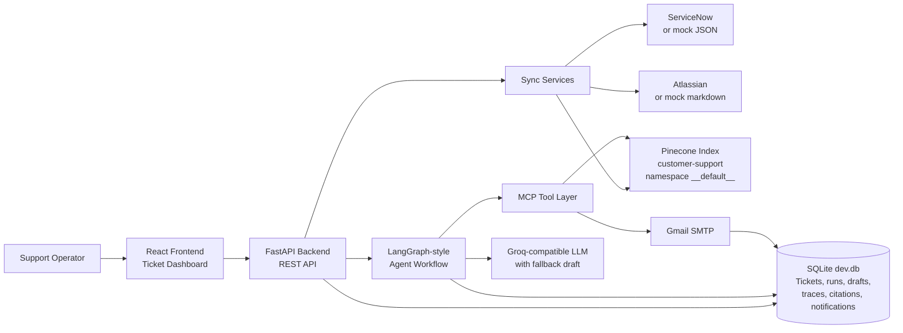

# AgenticAI Customer Support Resolution Platform

## What This Project Does

This application helps a support team resolve customer tickets with a controlled multi-agent workflow.

In simple terms:

1. The backend reads support tickets from ServiceNow or local demo data.
2. It reads knowledge articles from Atlassian or local markdown files.
3. It stores searchable knowledge in Pinecone using Pinecone integrated embeddings.
4. When an operator runs the agents, the system retrieves relevant knowledge, drafts a customer response, checks guardrails, stores citations, and records every agent step.
5. The operator can review the draft, approve it, request changes, and send a Gmail SMTP notification.
6. The frontend shows the complete workflow in a clean operations dashboard.

## Main Features

- ServiceNow ticket sync with local mock fallback for development.
- Pinecone live RAG retrieval using the `customer-support` index, `__default__` namespace, and `text` integrated-embedding field.
- Groq-compatible LLM response generation with deterministic fallback.
- MCP tool layer for knowledge search, ticket lookup, memory, and notification sending.
- Agent workflow with intake, retrieval, resolution, communication, evaluation, guardrails, and approval steps.
- SQLite persistence for tickets, runs, traces, drafts, citations, approvals, memory, and notifications.
- Gmail SMTP delivery through the app notification path.
- React dashboard for operations, review, approval, and delivery status.

## High-Level Architecture



## How The Main Files Work

### Backend

- `backend/main.py`: Creates the FastAPI application, enables CORS, registers routes, validates production settings, and initializes the database at startup.
- `backend/api/routes.py`: Defines API endpoints used by the frontend, such as ticket list, ticket detail, ServiceNow sync, knowledge sync, agent run, draft edit, approval, status, and notifications.
- `backend/core/config.py`: Loads `.env` settings for Pinecone, Gmail SMTP, Groq, MCP, ServiceNow, Atlassian, and database configuration.
- `backend/core/database.py`: Creates the SQLAlchemy database engine and initializes/migrates SQLite tables.
- `backend/core/models.py`: Defines database tables for tickets, runs, traces, drafts, citations, approvals, memory, knowledge documents, and notifications.
- `backend/core/status.py`: Builds the provider status shown on the frontend: database, LLM, Pinecone, ServiceNow, MCP, and notifications.
- `backend/agents/workflow.py`: Runs the agent process. It retrieves evidence, creates a response, sends or queues notification, evaluates confidence, applies guardrails, and saves all outputs.
- `backend/agents/llm.py`: Calls the Groq-compatible LLM if configured; otherwise returns a deterministic fallback response.
- `backend/mcp/server.py`: Implements tool calls used by agents, including ticket search, knowledge search, memory read/write, and notification send/queue.
- `backend/mcp/client.py`: Calls MCP over HTTP when configured, or falls back to in-process MCP during development.
- `backend/rag/knowledge_sync.py`: Reads Atlassian/mock knowledge, saves it locally, and upserts chunks to Pinecone.
- `backend/rag/pinecone_store.py`: Central Pinecone integration. It upserts `_id` and `text` records for integrated embeddings and searches Pinecone by query text.
- `backend/integrations/mail.py`: Sends real SMTP email when `NOTIFICATION_MODE=smtp`; otherwise queues locally.
- `backend/integrations/servicenow.py`: Fetches ServiceNow tickets or loads mock tickets in development.
- `backend/integrations/atlassian.py`: Fetches Confluence/Jira knowledge or lets the app use mock markdown when not configured.

### Frontend

- `frontend/src/App.tsx`: Loads the ticket dashboard as the main screen.
- `frontend/src/components/TicketDashboard.tsx`: Main operations UI. It displays provider status, tickets, selected ticket details, agent runs, editable drafts, citations, traces, approvals, and notifications.
- `frontend/src/api.ts`: Small frontend API client that calls the backend REST endpoints.
- `frontend/src/types/api.ts`: TypeScript shapes for backend API responses.
- `frontend/src/styles.css`: Professional dashboard styling, responsive layout, colors, panels, buttons, cards, and workflow views.

### Configuration And Data

- `.env`: Real local configuration. It contains live Pinecone and Gmail SMTP settings. Do not commit or share secrets.
- `.env.example`: Template configuration for others.
- `backend/mock_data/servicenow_tickets.json`: Demo tickets used when ServiceNow credentials are missing.
- `backend/mock_data/confluence/*.md`: Demo knowledge articles used when Atlassian credentials are missing.
- `dev.db`: Local SQLite database.
- `Images/`: Pinecone screenshots used as implementation references.

## How A Ticket Run Works Under The Hood

1. The operator selects a ticket and clicks **Run Agents**.
2. The frontend calls `POST /tickets/{ticket_id}/runs`.
3. FastAPI loads the ticket and starts `run_ticket_workflow`.
4. The workflow reads the ticket and memory through MCP tools.
5. The retrieval agent calls `knowledge.search`.
6. MCP searches Pinecone with the customer query text.
7. Pinecone returns matching knowledge chunks and scores.
8. The resolution agent asks the LLM to draft a response using retrieved evidence.
9. The communication agent sends or queues the notification through the mail client.
10. The evaluation agent calculates confidence.
11. The guardrail agent checks citations, draft quality, and policy conditions.
12. The system stores the run, draft, traces, citations, approvals, and notification record in SQLite.
13. The frontend refreshes and shows the complete run history.

## Running The App Locally

Backend:

```powershell
python -m uvicorn backend.main:app --host 127.0.0.1 --port 8000
```

Frontend:

```powershell
cd frontend
npm.cmd run dev -- --port 5173 --strictPort
```

Open:

```text
http://127.0.0.1:5173
```

## Verified Current Setup

- Pinecone mode: live.
- Pinecone index: `customer-support`.
- Pinecone namespace: `__default__`.
- Pinecone integrated embedding field: `text`.
- SMTP mode: `smtp`.
- SMTP readiness: true.
- Knowledge sync upserts records to Pinecone.
- Ticket workflow retrieves citations in `pinecone` mode.
- SMTP app-path notification can send successfully with the configured Gmail app password.
- Frontend production build passes.
- Backend tests pass.

## Important Notes

- Keep `.env` private because it contains API keys and SMTP credentials.
- Development can still use mock ServiceNow and mock Atlassian data.
- Production should use real ServiceNow and Atlassian credentials.
- If Gmail rejects SMTP, regenerate the Gmail app password and update `SMTP_PASSWORD`.
